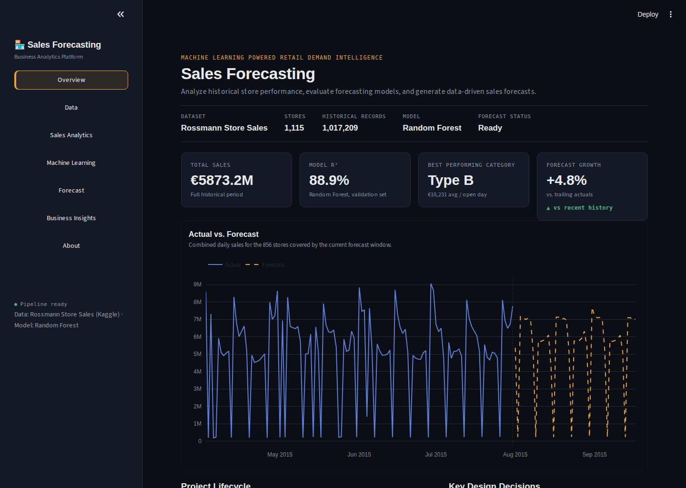
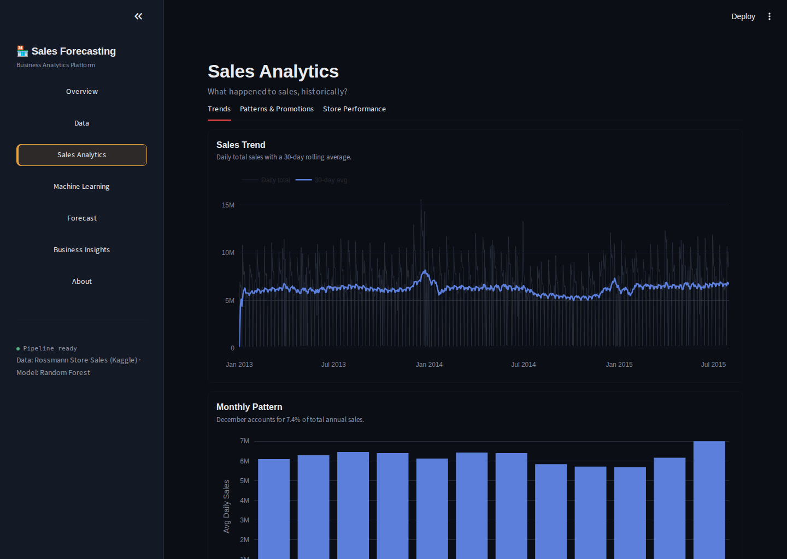
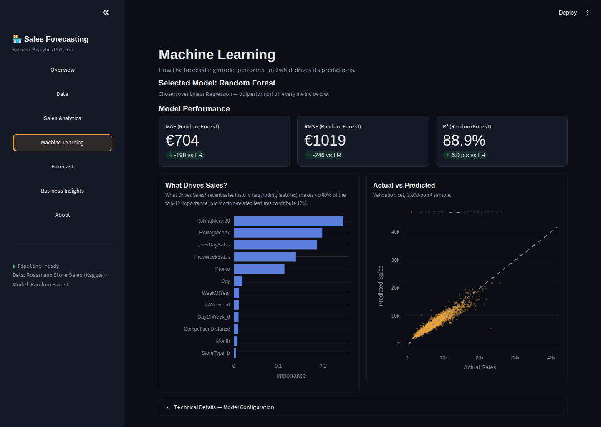
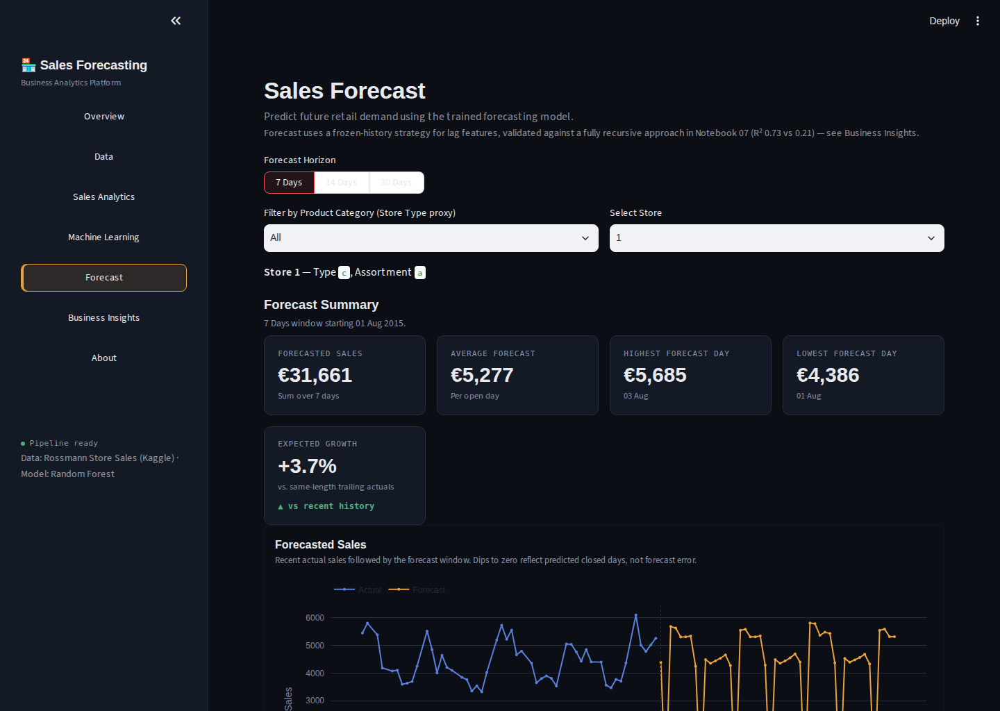
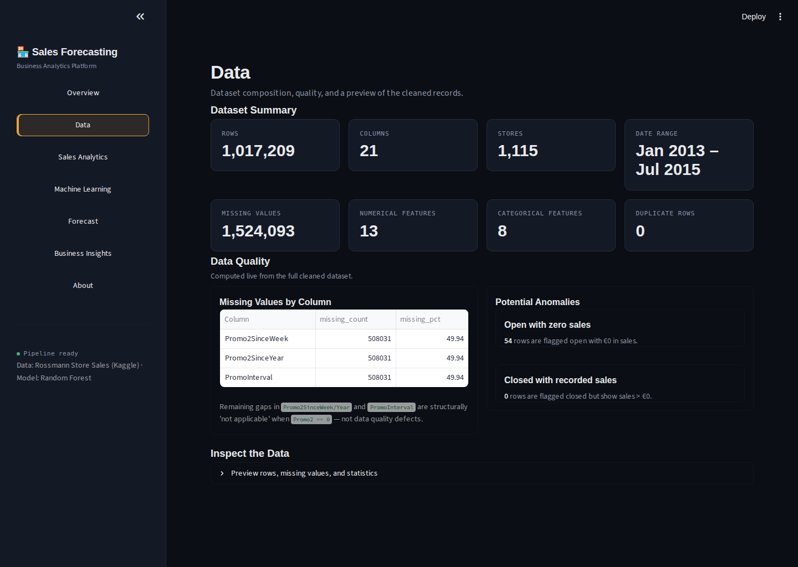
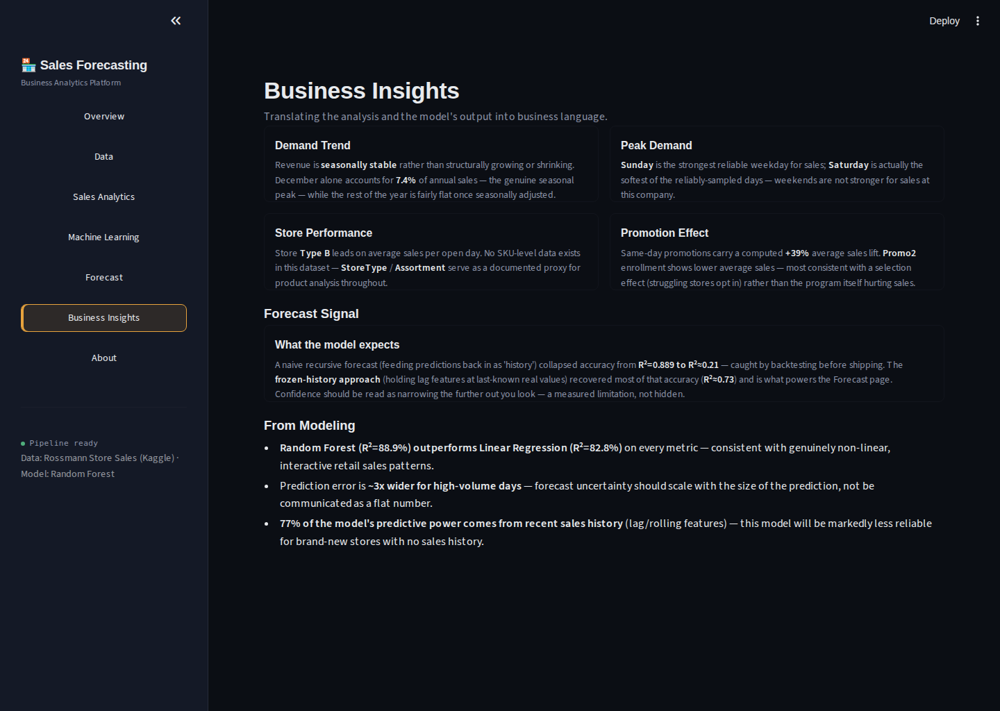

# Sales Forecasting & Business Analytics Platform

> End-to-end machine learning system that forecasts retail sales and surfaces
> business insights through an interactive Streamlit dashboard — built on the
> [Rossmann Store Sales](https://www.kaggle.com/competitions/rossmann-store-sales) dataset (1,115 stores, ~2.5 years of daily history).


---

## Overview

Retailers struggle to predict demand accurately, which leads to overstocking,
stockouts, and inefficient marketing spend. This project builds a complete,
production-style forecasting pipeline: data cleaning → exploratory analysis →
feature engineering → model training/comparison → evaluation → forecasting →
an interactive dashboard — with every design decision documented and, where
possible, backtested rather than assumed.

**Headline result:** a Random Forest model explains **88.9%** of validation-set
sales variance (R²), beating a Linear Regression baseline (82.8%) on every
metric, and a genuine multi-week forecast strategy that was empirically
validated — not just theorized — before shipping.

## Dashboard

| Overview | Sales Analytics |
|---|---|
|  |  |

| Machine Learning | Forecast |
|---|---|
|  |  |

| Data Quality | Business Insights |
|---|---|
|  |  |

## Key Findings

- **Random Forest (R²=88.9%) outperforms Linear Regression (R²=82.8%)** on
  every metric — consistent with genuinely non-linear, interactive retail
  sales patterns (Notebook 06).
- **Same-day promotions carry a real, well-supported +39% sales lift**
  (Notebook 03), and remain the single largest Linear Regression coefficient
  once the model controls for other factors (Notebook 06).
- **A naive recursive forecast collapses model accuracy from R²=0.889 to
  R²≈0.21** — caught by backtesting before shipping, not assumed away
  (Notebook 07). A frozen-history strategy recovered most of that accuracy
  (R²≈0.73) and powers the dashboard's Forecast page.
- **77% of the model's predictive power comes from recent sales history**
  (lag/rolling features) — meaning this model will be markedly less reliable
  for brand-new stores with no sales history, a limitation stated plainly
  rather than hidden.
- This dataset has **no SKU/product-level data** — `StoreType`/`Assortment`
  serve as a documented, approved proxy for product analysis throughout.

See the Business Insights dashboard page, or Notebooks 03/06/07, for the full
analysis behind each finding.

## Tech Stack

- **Language:** Python 3.12+
- **Data:** pandas, numpy
- **Visualization:** matplotlib, seaborn, Plotly
- **ML:** scikit-learn (Linear Regression, Random Forest)
- **Dashboard:** Streamlit
- **Persistence:** joblib

## Project Structure

```
Sales-Forecasting/
├── data/
│   ├── raw/          # Original Kaggle CSVs (gitignored — see Setup)
│   ├── processed/     # Cleaned/merged/featured datasets (gitignored, regenerated by notebooks)
│   └── sample/        # Small committed sample for quick demo without the full dataset
├── notebooks/          # 01–07: tutorial-style, fully executed analysis notebooks
├── src/                 # Reusable, importable pipeline modules (single source of truth)
├── dashboard/          # Streamlit application (app.py)
├── models/              # Trained model artifacts (gitignored, regenerated by Notebook 05)
├── outputs/            # predictions.csv, charts, reports (gitignored, regenerated)
├── docs/                # Architecture and planning documentation
├── screenshots/        # Dashboard screenshots used in this README
├── requirements.txt
├── .gitignore
├── LICENSE
└── README.md
```

## Setup

### 1. Install dependencies

```bash
git clone <repo-url>
cd Sales-Forecasting
python -m venv venv
source venv/bin/activate      # Windows: venv\Scripts\activate
pip install -r requirements.txt
```

### 2. Get the raw data

Kaggle's competition rules restrict redistribution, so the raw CSVs aren't
committed to this repo:

1. Create a free Kaggle account.
2. Go to [kaggle.com/competitions/rossmann-store-sales/data](https://www.kaggle.com/competitions/rossmann-store-sales/data)
   and accept the competition rules.
3. Download `train.csv`, `test.csv`, and `store.csv` into `data/raw/`.

### 3. Run the pipeline

Run the notebooks **in order**, top to bottom — each one writes an artifact
the next one (and the dashboard) depends on:

| Notebook | Produces |
|---|---|
| `01_data_understanding.ipynb` | (profiling only — no file output) |
| `02_data_cleaning.ipynb` | `data/processed/cleaned_sales_data.csv` |
| `03_eda.ipynb` | (charts embedded in the notebook itself) |
| `04_feature_engineering.ipynb` | `data/processed/featured_sales_data.csv` |
| `05_model_training.ipynb` | `models/linear_regression.pkl`, `models/random_forest.pkl` |
| `06_model_evaluation.ipynb` | (metrics/diagnostics — no file output) |
| `07_forecasting.ipynb` | `outputs/predictions.csv` |

### 4. Launch the dashboard

```bash
streamlit run dashboard/app.py
```

The dashboard reads the artifacts above — it never re-cleans data or retrains
models live. If you open it before running the notebooks, each page shows a
clear message telling you what to run first, rather than crashing.

## Methodology

Data Understanding → Cleaning → Exploratory Data Analysis (12 business-driven
visualizations) → Feature Engineering (with an explicit leakage audit against
`test.csv`'s real schema) → Model Training (chronological split, never random)
→ Model Evaluation (MAE/MSE/RMSE/R², diagnostic plots) → Forecasting
(recursive vs. frozen-history, empirically backtested) → this Dashboard.

Full architectural reasoning and every milestone's definition of done is in
[`docs/PROJECT_ARCHITECTURE.md`](docs/PROJECT_ARCHITECTURE.md).

## Known Limitations

Stated plainly, not hidden — each was discovered and quantified during
development, not guessed at:

- **No SKU/product-level data.** `StoreType`/`Assortment` are used as an
  approved, documented proxy for product analysis.
- **Raw Store ID is excluded from modeling** (avoids 1,115 one-hot columns for
  a fair Linear-Regression-vs-Random-Forest comparison) — two stores with
  identical characteristics currently receive identical predictions.
- **Multi-week forecasts are measurably less accurate than same-day
  predictions** (R² 0.73 vs. 0.889) — a real, backtested gap, communicated as
  "confidence narrows the further out you look."
- **Random Forest hyperparameters were tuned for a single-core sandbox
  environment**, not for maximum possible accuracy — documented in Notebook 05.
- **This model will be markedly less reliable for brand-new stores** with no
  sales history, since ~77% of its predictive power comes from lag/rolling
  sales-history features.

## Future Improvements

- Target-encode Store ID (or train a per-cluster model) to capture
  store-specific effects beyond `StoreType`/`Assortment`.
- Train a second model specifically for multi-step-ahead forecasting, with a
  "days since last real observation" feature, so the model can learn how much
  to discount stale history itself rather than freezing it uniformly.
- Add XGBoost/LightGBM as an optional third model for comparison (both are
  already in `requirements.txt`; deferred in this build to keep training time
  reasonable on a single-core sandbox — see Notebook 05).
- A proper before/after study of `Promo2` enrollment to resolve the
  correlation-vs-causation ambiguity flagged in Notebook 03/Business Insights.

## Roadmap

- [x] Project scaffolding & environment setup
- [x] Data understanding & cleaning
- [x] Exploratory Data Analysis (12 business-driven visualizations)
- [x] Feature engineering (with a leakage audit)
- [x] Model training (Linear Regression, Random Forest)
- [x] Model evaluation & comparison
- [x] Forecast generation (recursive vs. frozen-history, backtested)
- [x] Streamlit dashboard
- [x] Screenshots & final documentation polish

## License

This project is licensed under the MIT License — see [LICENSE](LICENSE) for details.
